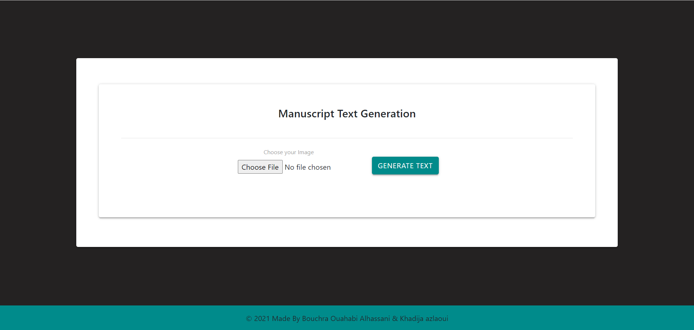
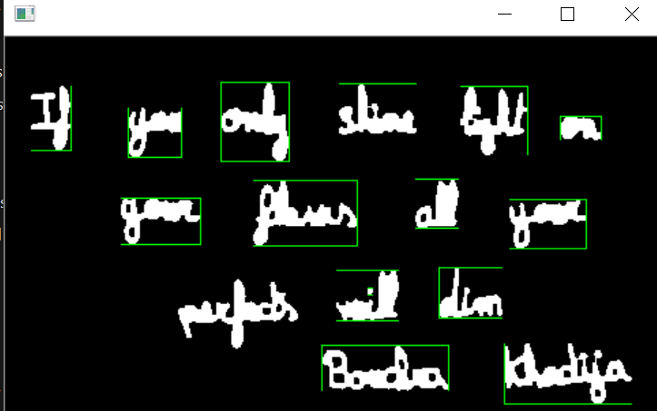
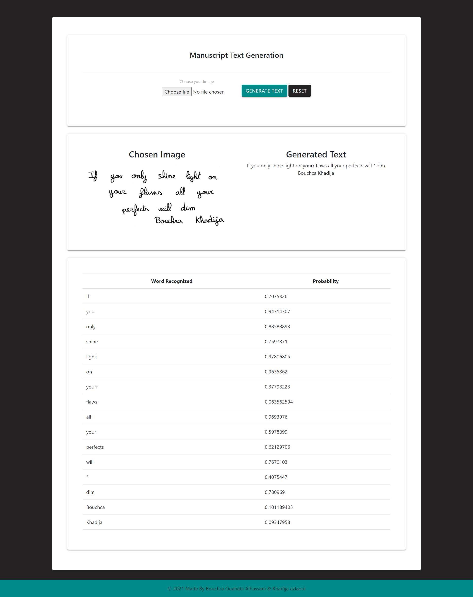

# Manuscript_text_generation

Manuscript text generation using Python 3, Flask, Tensorflow 2, OpenCV 

# Usage

1- Download the IAM dataset (words/words.tgz and ascii/words.txt) from the official website.

2- Create the directory ./data , extract in it the downloaded files.

3- Create another directory ./model where your model will be saved.

4- Train your model by changing the directory to ./src/model and run the command : "python main.py --train"

5- You can validate your model using the command: "python main.py --validate"

6- You can test the model using a test image "../data/test.png" by running the command : python main.py

# To run the project as a whole with frontend

cd ./src

python app.py

